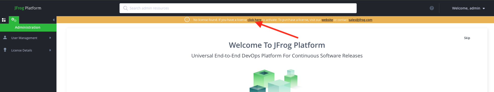

# HiddenLayer Artifactory Model Security Plugin

    A JFrog Artifactory User Plugin for scanning ML Models.

## Overview

## Getting Started

> [!IMPORTANT]
> We use Devcontainers to provide a consistent IDE experience
> Please follow the IDE Bootstrap steps to ensure that you are running in a devcontainer.

### IDE Bootstrap

1. Install VSCode Extension: https://marketplace.visualstudio.com/items?itemName=ms-vscode-remote.remote-containers
2. cmd-shift-p -> "Dev Containers: Reopen In Container" (or click the blue array at the bottom-left corner)
3. `gh auth login`
4. `gh auth setup-git`
5. `git config --global user.email "[username_here]@hiddenlayer.com" && git config --global user.name "[first_name] [last_name]"`

To facilitate testing and setup, the following environment variables will be brought into the devcontainer environment:

* HL_CLIENT_ID - The client ID for the HiddenLayer API
* HL_CLIENT_SECRET - The client secret for the HiddenLayer API

### Running the Plugin

1. Start Artifactory Container
```bash
docker compose up
```
2. Navigate to `localhost:8082` to see the 
   - If prompted enter a new password. (i.e. `Fr0gg3r`)
3. Click on the banner to activate Artifactory.

4. Enter a License and click `Save`.
5. Set up a new HuggingFace Repository
   - Click on `Welcome` in the top right corner
   - Click on `New Remote Repository`
   - Select `HuggingFace`
   - Set the repository key (something like `hf`)
   - Click `Create Remote Repository`
6. Configure the plugin
   - Open the file `./core/src/hiddenlayer.properties`
   - Add your hiddenlayer API auth client_id and client_secret
   - record the repository IDs for the repositories you want to scan
7. Reload the plugin
    ```bash
    curl -XPOST -uadmin:<password> localhost:8081/artifactory/api/plugins/reload
    ```

Now, whenever you download a model using the HuggingFace cli, the plugin will upload the model
to the HiddenLayer API for scanning.  Based on your configuration, the plugin will either block
the download or allow it to proceed.

### Running automated tests

1. Ensure the Artifactory container is running
```bash
docker compose up
```
2. Run the tests
```bash
gradle test
```

## Resources

 - [User Plugins](https://jfrog.com/help/r/jfrog-integrations-documentation/user-plugins)
    - [Plugin Execution Points](https://jfrog.com/help/r/jfrog-integrations-documentation/plugin-execution-points)
 - [Docker Image](https://releases-docker.jfrog.io/ui/repos/tree/General/artifactory-pro/org)
   - [JFROG_HOME location in container](https://jfrog.com/help/r/jfrog-installation-setup-documentation/jfrog-home)
 - [Snyk Security Plugin](https://github.com/snyk/artifactory-snyk-security-plugin)